# TGINS: Tightly couple GNSS/INS system,基于[RTKLIB](https://github.com/tomojitakasu/RTKLIB.git)修改的GNSS/INS紧组合代码

## 一. 支持功能
1. 继承[RTKLIB-demo5](https://github.com/rtklibexplorer/RTKLIB)
2. 支持GNSS/INS松组合
3. 支持GNSS/INS松组合RTS
4. 支持GPS PPK/INS半紧组合、紧组合
5. 支持GPS PPP/INS紧组合
6. **支持NED-FRD、ENU-RFU姿态定义的GNSS/INS松、紧组合**
7. 结果\误差可视化（FUSING-PLOT）

## 二. 结果示例
1. PPK/INS松组合（loosely coupled）  
   以[i2NAV](https://github.com/i2Nav-WHU/awesome-gins-datasets)公开数据集(ADIS16465)为例

    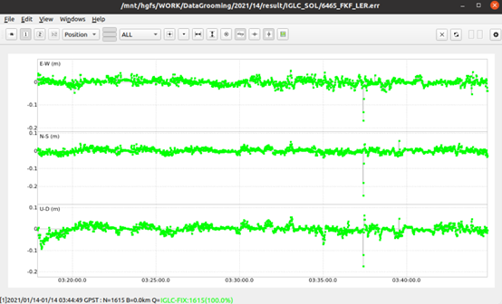
    
    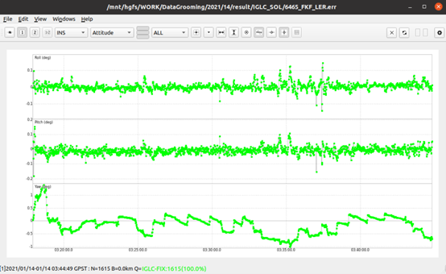
     
    
ADIS16465松组合-位置、速度、姿态误差

    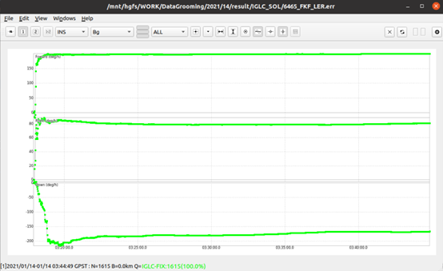
    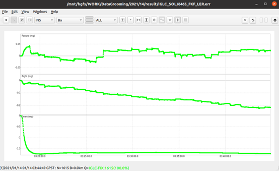
     
    
ADIS16465松组合-陀螺、加计零偏

    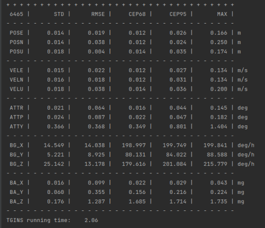
     
    
ADIS16465松组合-误差统计

    <video width="520" height="440" controls>
    <source src="./doc/source/6465/all.mp4" type="video/mp4">
    </video>

  以2019-100C-北京数据集为例，IE后处理平滑结果作为参考  

    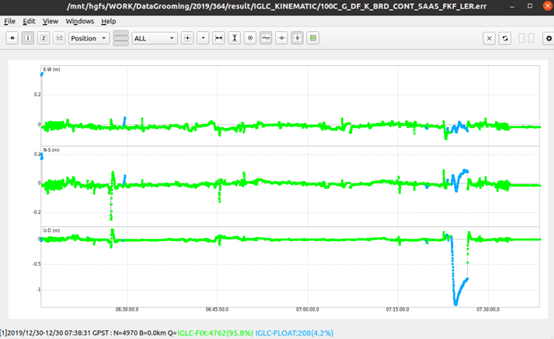
    
    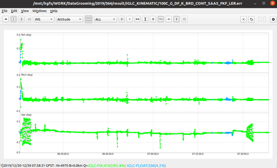
     
    
100C松组合-位置、速度、姿态误差

    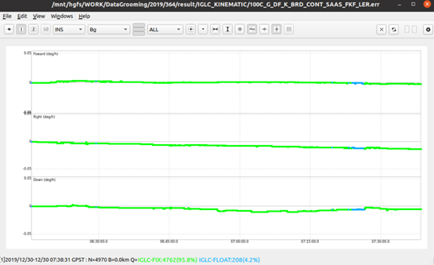
    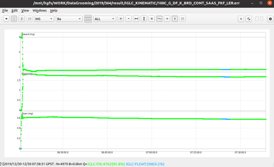
     
    
100C松组合-陀螺、加计零偏

    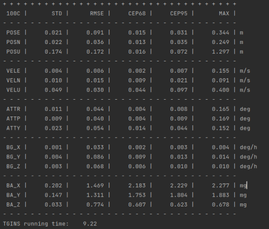
     
    
100C松组合-误差统计

    <video width="520" height="440" controls>
    <source src="./doc/source/100C/lc-obs/all.mp4" type="video/mp4">
    </video>

3. PPK/INS半紧组合 （semi-tightly coupled）    
   以2019-100C-北京数据集为例，IE后处理平滑结果作为参考

    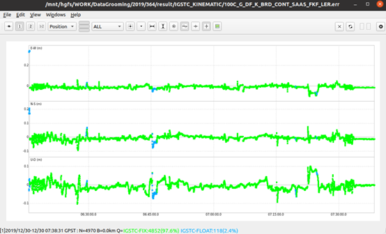
    
    
     
    
100C半紧组合-位置、速度、姿态误差

    
     
    
100C半紧组合-误差统计

    <video width="520" height="440" controls>
    <source src="./doc/source/100C/stc-ppk/all.mp4" type="video/mp4">
    </video>

4. PPK/INS紧组合 （tightly coupled）  
   以2019-100C-北京数据集为例

    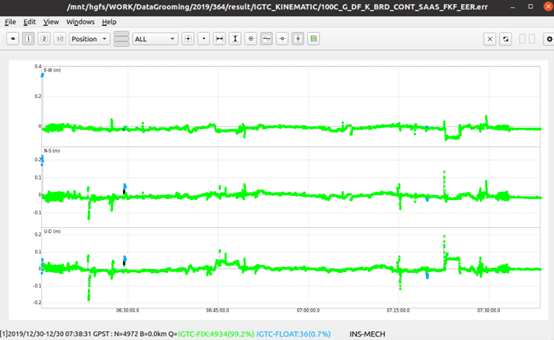
    
    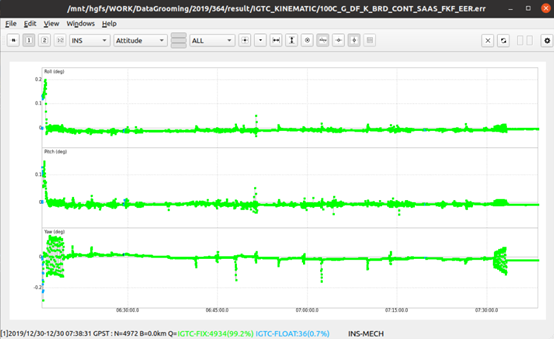
     
    
100C PPK/INS紧组合-位置、速度、姿态误差

    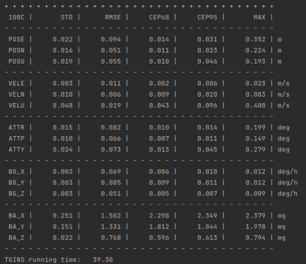
     
    
100C PPK/INS紧组合-误差统计

    <video width="520" height="440" controls>
    <source src="./doc/source/100C/tc-ppk/all.mp4" type="video/mp4">
    </video>

5. PPP/INS紧组合 （tightly coupled）  
   以2019-100C-北京数据集为例

    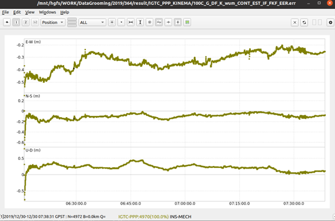
    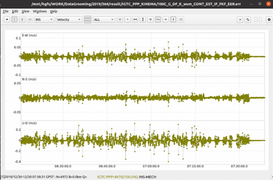
    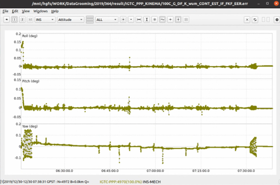
     
    
100C PPP/INS紧组合-位置、速度、姿态误差

    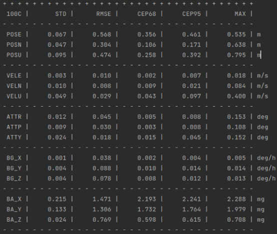
     
    
100C PPP/INS紧组合-误差统计

    <video width="520" height="440" controls>
    <source src="./doc/source/100C/tc-ppp/all.mp4" type="video/mp4">
    </video>

## 三. 编译依赖  
1. YAML(>=0.6)
2. Eigen(>=3.40)
3. 调试建议在ubuntu使用CLION，FUSING-PLOT运行可能需要依赖QT(>=5.15)

## 四. 数据准备  
1. 可在配置文件中手动配置所需要的文件路径
2. 若自动匹配所需要的文件，则需要按一定结构存储所需要的观测文件和产品文件，只需在配置文件中配置主文件路径即可

    
     
    
主文件夹示例

    
     
    
year文件夹示例

    
     
    
doy文件夹示例

    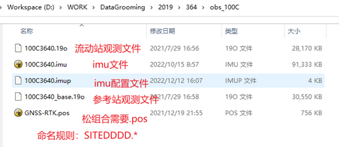
     
    
obs文件夹示例

    
     
    
products文件夹示例

## 五. 存在的问题
- [x] PPP/INS紧组合：ppp/ins紧组合算法已实现，可运行，基于rtklib的ppp算法需进一步的优化
- [x] 多星座GNSS：仅测试了单GPS，后续会支持多星座GNSS
- [x] 算法鲁棒性： 仅测试了两组数据验证算法的稳定性，后续会增加测试不同场景数据
- [x] 完善文档说明
- [x] ...

## 六. 说明
- [x] 代码质量和结构仍存在漏洞，仅作参考。
- [x] 代码会陆续更新，但需要一定时间，直至完全支持多星座多频PPP/INS、PPK/INS紧组合
- [x] 希望能做成一个有意义的项目，欢迎大家有数据的能够投喂，双天线/GNSS/INS/UWB/ODO/CAMERA/LiDAR/手机等、车载、机载、船载等,后续会继续上传一些车载GNSS/INS紧组合数据
- [x] 作者：黑娃（chenchaochn@163.com，安徽理工大学空间信息与测绘工程学院导航工程系）